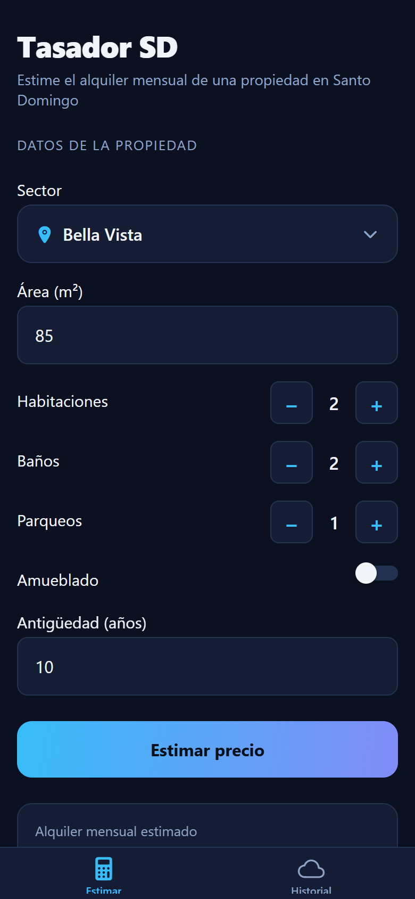
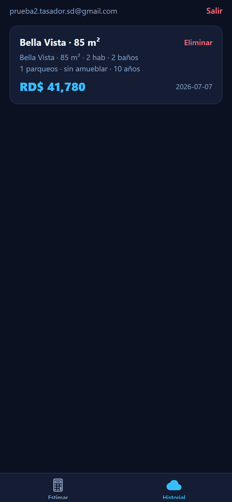
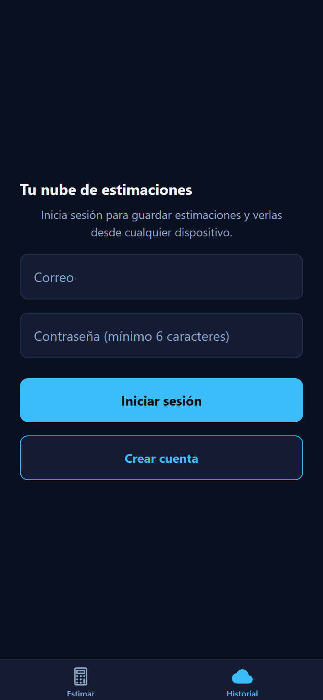

# Tasador SD - Mobile

Mobile app (iOS/Android) for the [Santo Domingo rental price estimator](https://github.com/Criscarr26/rental-price-estimator-sd). Enter a property's sector, size and features and get an instant monthly rent estimate in DOP, with a confidence range and a comparison against the sector average. Every estimate is logged automatically to the cloud, keeping a searchable history of what each client looked for.

Built with Expo (React Native + TypeScript) and Supabase. Part of a product suite together with the [web estimator](https://rental-price-estimator-sd.streamlit.app) and the [real-market data agent](https://github.com/Criscarr26/rental-listings-agent).

> **Status:** working demo. The suite is being unified into a single SaaS platform (shared API, auth and data layer); this repository stays as the standalone mobile demo.

| Estimate | Cloud history | Sign in |
|:---:|:---:|:---:|
|  |  |  |

## Features

- **Instant on-device appraisal** - the trained scikit-learn pipeline (R² 0.93) is exported to JSON and evaluated locally: no inference server, works offline, zero latency.
- **Cloud search history** - every estimate is saved automatically per user (email/password auth), so agents keep a record of what each client searched. Tap two cards to compare them.
- **Row Level Security** - each user can only read and delete their own history, enforced in Postgres, not in the client.
- **Graceful degradation** - without cloud credentials the estimator still works fully; only the history is disabled.

## How the model gets into the app

```
rental-price-estimator-sd          this repo
┌──────────────────────┐   export   ┌─────────────────────────┐
│ train.py             │──────────► │ assets/model_params.json │
│ models/rental_model  │  (script)  │ src/lib/model.ts (port)  │
└──────────────────────┘            └───────────┬──────────────┘
                                                │ verified against
                                                ▼ the real pipeline
                                    scripts/verify-model.mjs
```

`scripts/export_model.py` extracts the fitted OneHotEncoder + StandardScaler + LinearRegression parameters, plus reference predictions. `scripts/verify-model.mjs` replays those references through the TypeScript port and fails on any mismatch, so the port can never silently drift from the Python model.

## Project structure

```
src/app/          expo-router screens: index (Estimar), saved (Historial)
src/lib/          model port, Supabase client, session context
src/components/   sector picker (bottom sheet)
assets/           model_params.json (exported model weights)
scripts/          export_model.py, verify-model.mjs
supabase/         schema.sql (table + RLS policies)
```

## Getting started

1. Install dependencies: `npm install`
2. Cloud setup (optional, needed only for the history):
   - Create a free project at [supabase.com](https://supabase.com).
   - Run `supabase/schema.sql` in the SQL Editor.
   - For quick testing, disable "Confirm email" under Authentication > Sign In / Up.
   - Copy `.env.example` to `.env` and fill in the Project URL and publishable key.
3. Start the dev server: `npx expo start`
4. Scan the QR code with the [Expo Go](https://expo.dev/go) app (same Wi-Fi network).

> Note: the project targets Expo SDK 54 on purpose - it is the newest SDK the iOS
> App Store build of Expo Go supports (Apple has newer versions stuck in review).

## Verification

```
npx tsc --noEmit                # type check
node scripts/verify-model.mjs   # model port matches the Python pipeline
```

## Retraining

When the model is retrained in the estimator repo, re-export the weights:

```
python scripts/export_model.py <path-to-rental-price-estimator-sd>
```

## Tech stack

Expo SDK 54 · React Native 0.81 · TypeScript · expo-router · Supabase (Auth + Postgres + RLS) · scikit-learn (model, exported)

## License

[MIT](LICENSE)
